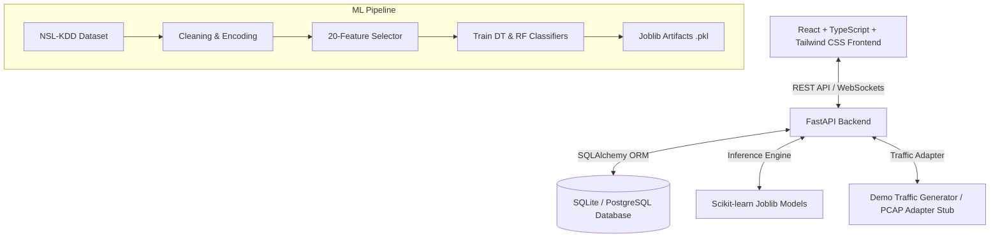

# AI-Based Network Intrusion Detection System (AI-NIDS)

Production-grade, full-stack cybersecurity web platform for real-time Network Intrusion Detection using Machine Learning trained on the **NSL-KDD benchmark dataset**.

--

## 1. System Architecture



---
## 2. Key Features

- **NSL-KDD Supervised ML Classification**: Compares **Random Forest** and **Decision Tree** models trained on 20 discriminative traffic features.
- **Real-Time Live Traffic Stream**: Continuous WebSocket stream broadcasting simulated network traffic flows and live intrusion verdicts to the SOC dashboard.
- **Interactive Detection Test Bench**: Form interface allowing security analysts to enter custom network vectors or apply attack presets (DoS SYN Flood, Port Sweep Probe, Normal HTTP).
- **SOC Alert Management**: Automatic alert generation upon attack detection with configurable severity scoring (`CRITICAL`, `HIGH`, `MEDIUM`, `LOW`) and lifecycle status transitions (`OPEN`, `ACKNOWLEDGED`, `RESOLVED`).
- **Role-Based Access Control (RBAC)**: JWT authentication enforcing granular permissions for `ADMIN`, `ANALYST`, and `VIEWER` roles.
- **Audit Logging**: Persisted database event tracking for login attempts, manual predictions, alert acknowledgments, and API usage.
- **ML Performance Analytics**: Visual confusion matrices, accuracy comparisons, and top 20 feature importances bar charts.

---

## 3. Technology Stack

- **Frontend**: React 18, TypeScript, Vite, Tailwind CSS, Recharts, Lucide React icons, Axios.
- **Backend**: Python 3.11+, FastAPI, Uvicorn, Pydantic v2, SQLAlchemy ORM.
- **Machine Learning**: Scikit-Learn, Pandas, NumPy, Joblib.
- **Database**: SQLite (local development) / PostgreSQL (production docker).
- **Containerization**: Docker & Docker Compose.

---

## 4. ML Pipeline & Model Metrics

Model performance evaluated on the official **NSL-KDD Test Set (22,544 samples)** using the 20 top selected features:

| Model Classifier | Accuracy | Precision | Recall | F1-Score | Status |
| :--- | :---: | :---: | :---: | :---: | :---: |
| **Random Forest** | **78.00%** | **96.68%** | **63.53%** | **76.68%** | **SELECTED BEST** |
| **Decision Tree** | 75.96% | 96.13% | 60.19% | 74.03% | Evaluated |

### Top 20 Selected Features
`['src_bytes', 'dst_bytes', 'flag', 'logged_in', 'same_srv_rate', 'dst_host_srv_count', 'diff_srv_rate', 'dst_host_same_srv_rate', 'serror_rate', 'srv_serror_rate', 'service', 'count', 'dst_host_same_src_port_rate', 'protocol_type', 'dst_host_srv_diff_host_rate', 'dst_host_srv_serror_rate', 'dst_host_diff_srv_rate', 'srv_count', 'dst_host_count', 'dst_host_rerror_rate']`

---

## 5. Getting Started & Installation

### Prerequisites
- Python 3.11+
- Node.js 18+ & npm

### 1. Install Backend Dependencies & Train Model

```bash
# Install Python packages
pip install -r requirements.txt

# Run ML pipeline to download NSL-KDD dataset and train models
python backend/ml/train.py
```

### 2. Start FastAPI Backend Server

```bash
# From workspace root
uvicorn backend.app.main:app --reload --port 8000
```
Backend API interactive documentation available at `http://localhost:8000/docs`.

### 3. Start React Frontend Server

```bash
# Navigate to frontend folder
cd frontend

# Install Node dependencies
npm install

# Run Vite dev server
npm run dev
```
Open `http://localhost:5173` in your browser.

---

## 6. Default Demo Credentials

| Role | Email | Password | Permissions |
| :--- | :--- | :--- | :--- |
| **ADMIN** | `admin@nids.sec` | `Admin@123456` | Full system access, resolve alerts |
| **ANALYST** | `analyst@nids.sec` | `Analyst@123456` | View traffic, acknowledge/resolve alerts |

---

## 7. Running Backend Tests

```bash
# Execute Pytest suite
pytest
```

---

## 8. Docker Deployment

```bash
# Build and run containers for backend, frontend, and PostgreSQL
docker-compose up --build
```

---

## 9. Important Technical Limitations

1. **NSL-KDD Dataset Scope**: NSL-KDD is a research benchmark dataset. While effective for learning baseline features, modern production networks require continuous model retraining on contemporary traffic captures.
2. **Packet Capture Privileges**: Real-time packet sniffer mode (`PacketCaptureAdapter`) requires administrative/root privileges and network interface configuration. Demo mode (`DemoTrafficAdapter`) streams simulated traffic without special permissions.
3. **Supervised vs Zero-Day Detection**: Supervised classifiers detect known attack signatures present in the dataset. Detection of novel zero-day exploits requires future unsupervised anomaly detection integration.

---

## 10. Future Roadmap

- **Phase 1**: NSL-KDD + Decision Tree / Random Forest (Completed)
- **Phase 2**: Real-time packet capture adapter integration via Scapy
- **Phase 3**: WebSocket live SOC event monitoring (Completed)
- **Phase 4**: Unsupervised Autoencoder anomaly detection for zero-day threat isolation
- **Phase 5**: Deep Learning LSTM sequence models for temporal flow analysis
- **Phase 6**: Syslog / CEF forwarding for Splunk & Elastic SIEM integration
- **Phase 7**: Automated firewall IP blocking via authorized API hooks
- **Phase 8**: Continuous model retraining pipeline
- **Phase 9**: Threat intelligence feed integration (MISP / AlienVault OTX
